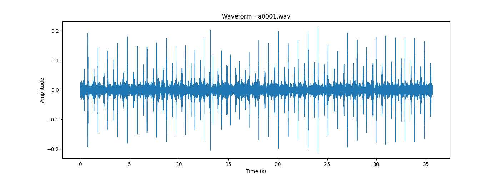
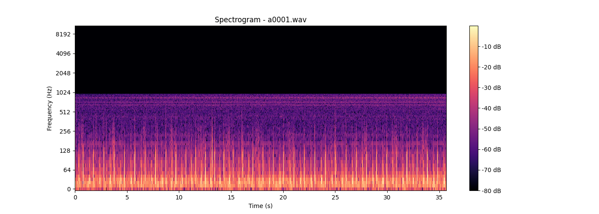

# Heart-Rate
 

## This Repo Deals with the Visualization  of Heart beat or Audio files into Waveform & Spectroscopy 

 
 

## Waveform:-

### Waveform is a graphical representation of sound waves. It shows the amplitude

 

## Spectrogram:-

### Spectrogram is a graphical representation of the frequency content of a sound over

